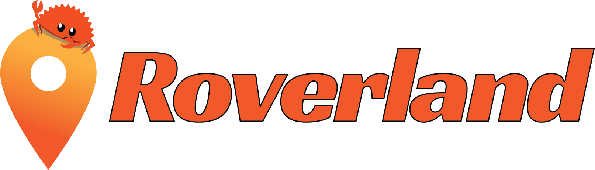

  

## Description

Roverland is a backend server and web app created for the Overland-iOS app. This
is a personal project I started to keep track of my location in a
privacy-preserving way. I self-host a Roverland server which has been tracking
my location for several months.

The web app is still quite simple and lacks many features, but it's enough to
roughly explore my past locations.

## Build
